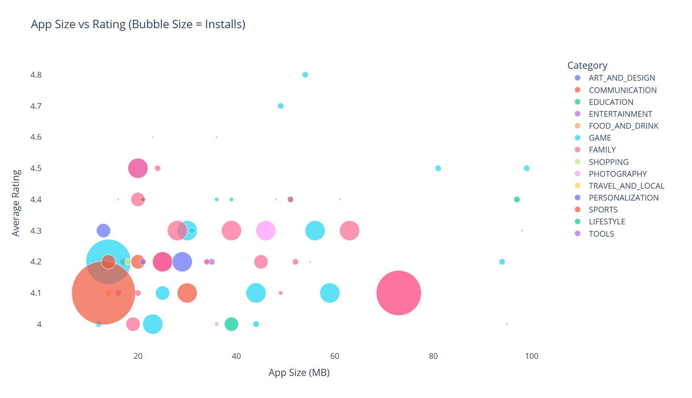

# 📱 Time-Sensitive Bubble Chart Analysis of High-Engagement Apps

This project generates an **interactive bubble chart** to visualize high-engagement apps from the Google Play Store, with the twist that the chart **only displays between 5 PM and 7 PM IST**.

---

## 🎯 Objective

Analyze and visualize apps based on:

- 📦 Size (MB)
- ⭐ Average Rating
- 📥 Number of Installs
- 📚 Category

Only apps meeting **engagement-focused filters** are included.

---

## 🔍 Filter Criteria

Apps must meet **all** the following:

- **Rating ≥ 4.0**
- **Size ≥ 10MB**
- **Installs > 50,000**
- **Reviews > 500**
- **Last Updated in January**

---

## 🕒 Time Lock Feature

The bubble chart will **only render between 5 PM and 7 PM IST**. Outside this window, a message will be shown instead.

---

## 📊 Chart Details

Using `Plotly`, the bubble chart plots:

- `X-axis`: App Size in MB
- `Y-axis`: Average Rating
- `Bubble Size`: Number of Installs
- `Bubble Color`: App Category

Interactive tooltips show:

- App Name
- Review Count
- Installs

---

## 📁 Files

```
📂 Project Folder
├── time_sensitive_bubble_chart_analysis_of_high_engagement_apps_by_size,_rating,_and_installs_in_selected_categories.py
├── googleplaystore.csv
└── README.md
```

---

## 🧰 Technologies Used

- `pandas`, `numpy` – Data handling
- `plotly.express` – Interactive visualization
- `datetime`, `pytz` – Timezone-aware logic

---

## 🚀 How to Run

1. Ensure `googleplaystore.csv` is in the same directory.
2. Install required packages:

```bash
pip install pandas numpy plotly pytz datetime
```

3. Run the script:

```bash
python bubble_chart_analysis.py
```

✅ Run it between **5 PM and 7 PM IST** to see the interactive chart.

---

## 📊 Chart Output



---

## 👨‍💻 Author

**Shawat Saxena**  

---
